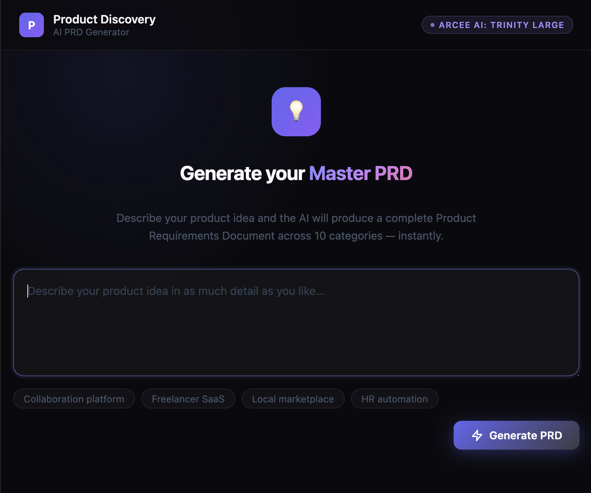

# Product Discovery AI

An AI-facilitated product discovery interview app. Describe your product idea and the AI guides you through 10 structured categories — from problem definition to risks — producing a complete `MASTER_PRD.md` draft at the end.

## How it works

1. Open the app and describe your product idea
2. The AI asks up to 3–4 questions per category, probes vague answers, and summarizes each section before moving on
3. After all 10 categories are covered, the AI produces a comprehensive PRD draft

**Categories covered:** Problem & Value Proposition · Target Audience · Core Features (MVP) · User Journey & UX · Business Model · Competitive Landscape · Design Language · Technical Constraints · Success Metrics · Risks & Assumptions

## Stack

- **FastAPI** — web framework
- **Jinja2** — HTML templating
- **OpenRouter** — LLM API gateway (model: `arcee-ai/trinity-large-preview`)
- **uv** — package manager




## Setup

**1. Clone and install dependencies**

```bash
uv sync
```

**2. Set environment variables**

Create a `.env` file in the project root:

```env
OPENROUTER_KEY=your_openrouter_api_key
```

Get a key at [openrouter.ai](https://openrouter.ai).

**3. Run the server**

```bash
uv run uvicorn app.main:app --reload
```

Open [http://localhost:8000/product-discovery/](http://localhost:8000/product-discovery/).

## Project structure

```
app/
  main.py                          # FastAPI app entry point
  modules/
    productDiscovery/
      router.py                    # Routes + in-memory session management
      prompt.py                    # System prompt for the AI facilitator
  utils/
    openai.py                      # OpenRouter client setup
templates/
  index.html                       # Chat UI
  prd_facilitator.html             # PRD result view
```

## Notes

- Conversation history is stored in memory per session (cookie-based). Restarting the server clears all sessions.
- Click **New session** in the header to reset and start over.
